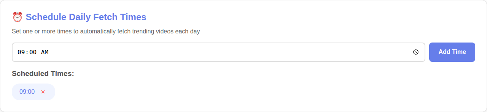
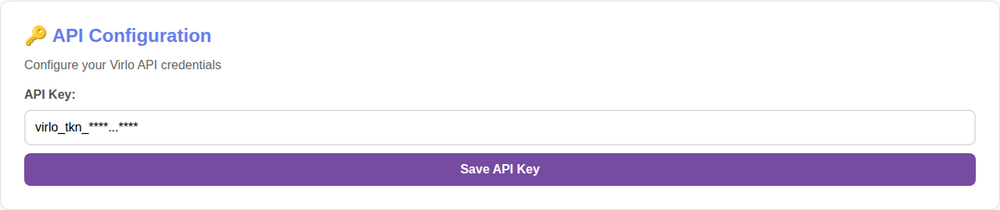
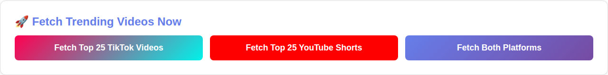
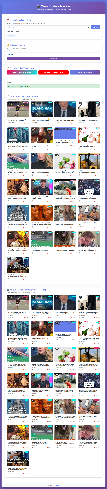
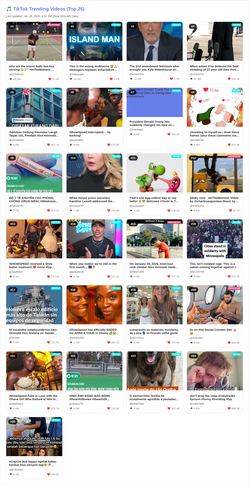
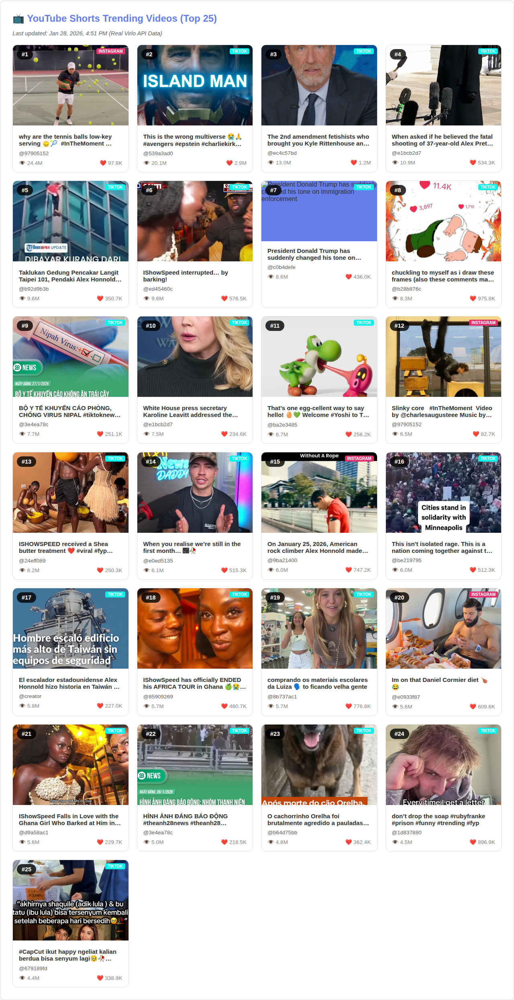
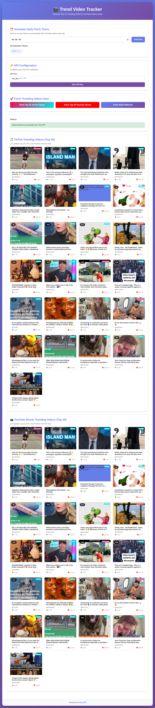

# Trend Video Tracker - Setup Guide

This guide walks you through setting up and using the Trend Video Tracker application step by step.

## Prerequisites

Before starting, ensure you have:

1. **Python 3** or **Node.js** installed (for running a local server)
2. **A modern web browser** (Chrome 90+, Firefox 88+, Safari 14+, Edge 90+)
3. **A Virlo API key** from [https://dev.virlo.ai](https://dev.virlo.ai)

### Environment Check Results

| Component | Version |
|-----------|---------|
| Python | 3.11.14 |
| Node.js | v22.22.0 |
| API Key | Found in environment as `VRLO_API_KEY` |

---

## Step 1: Start the Local Server

Open a terminal and navigate to the project directory, then start a local server:

```bash
# Using Python 3 (recommended)
python3 -m http.server 8000

# OR using Node.js
npx http-server -p 8000
```

Then open your browser and go to: `http://localhost:8000`

---

## Step 2: Initial Application View

When you first load the application, you'll see the main interface with four sections:


The interface includes:
- **Header** - App title and description
- **Schedule Daily Fetch Times** - Set automatic fetch times
- **API Configuration** - Enter your Virlo API key
- **Fetch Trending Videos Now** - Manual fetch buttons
- **Status** - Shows operation results

---

## Step 3: Configure the Scheduler (Optional)

You can schedule automatic daily fetches at specific times:

1. Click on the time input field
2. Select your desired time (e.g., 09:00)
3. Click **"Add Time"**

The scheduled time will appear as a removable badge:



**Features:**
- Add multiple scheduled times
- Remove times by clicking the "x" on the badge
- Schedules persist in browser localStorage

---

## Step 4: Configure API Key

Enter your Virlo API key to enable video fetching:

1. Locate the **API Configuration** section
2. Enter your API key in the input field
3. Click **"Save API Key"**



A success message will appear in the Status section:


**Note:** The API key is stored in your browser's localStorage. Only use on trusted computers.

---

## Step 5: Fetch Trending Videos

Once your API key is configured, you can fetch trending videos:

### Fetch Controls



Three options are available:
- **Fetch Top 25 TikTok Videos** - Get TikTok trending videos
- **Fetch Top 25 YouTube Shorts** - Get YouTube trending shorts
- **Fetch Both Platforms** - Get videos from both platforms

### During Fetch

When fetching, the Status section will show a loading message:



---

## Step 6: View Results

### TikTok Results

After fetching TikTok videos, you'll see a grid of the Top 25 trending videos:



Each video card displays:
- **Rank badge** (#1 - #25)
- **Video thumbnail**
- **Video title**
- **Creator username**
- **View count**
- **Like count**

### YouTube Results

Similarly, YouTube Shorts results are displayed in a grid:



---

## Step 7: Final View with All Results

When both platforms are fetched, the full page shows all results:



---

## Features Summary

| Feature | Description |
|---------|-------------|
| **Multi-platform support** | TikTok and YouTube Shorts |
| **Scheduler** | Set automatic daily fetch times |
| **Local caching** | Results cached for 24 hours |
| **Responsive design** | Works on desktop and mobile |
| **No backend required** | Pure client-side application |
| **Persistent settings** | API key and schedules saved in localStorage |

---

## Troubleshooting

### API Key Issues
- Ensure your API key is valid and active
- Check the Status section for error messages
- Try saving the key again

### No Videos Displayed
- Verify internet connection
- Check if the API key is correctly entered
- Look at the browser console for errors (F12 > Console)

### Scheduler Not Working
- The browser tab must remain open for scheduled fetches
- Schedules are stored in localStorage, clear it to reset

---

## Security Notes

- **API Key Storage**: The key is stored in plain text in localStorage
- **Only use on trusted computers**: Avoid shared or public machines
- **Never commit API keys**: The `.gitignore` file prevents accidental commits

---

## File Structure

```
trendvideo-UI/
├── index.html       # Main HTML structure
├── app.js           # Application logic
├── styles.css       # Styling
├── README.md        # Project documentation
├── SETUP_GUIDE.md   # This setup guide
└── screenshots/     # Documentation screenshots
    ├── 01-full-page-initial.png
    ├── 02-header-section.png
    ├── 03-scheduler-section.png
    ├── 04-api-config-section.png
    ├── 05-fetch-controls.png
    ├── 06-scheduler-with-time.png
    ├── 07-api-key-saved.png
    ├── 08-status-message.png
    ├── 09-app-configured.png
    ├── 10-fetching-tiktok.png
    ├── 11-tiktok-results.png
    ├── 12-tiktok-video-grid.png
    ├── 13-fetching-youtube.png
    ├── 14-youtube-results.png
    ├── 15-youtube-video-grid.png
    └── 16-final-full-page.png
```

---

## Quick Start Summary

1. Start server: `python3 -m http.server 8000`
2. Open browser: `http://localhost:8000`
3. Enter API key and click "Save API Key"
4. Click "Fetch Both Platforms" to get trending videos
5. (Optional) Set scheduled times for automatic fetches

---

*Guide generated on: January 28, 2026*
*Application tested successfully with Virlo API*
